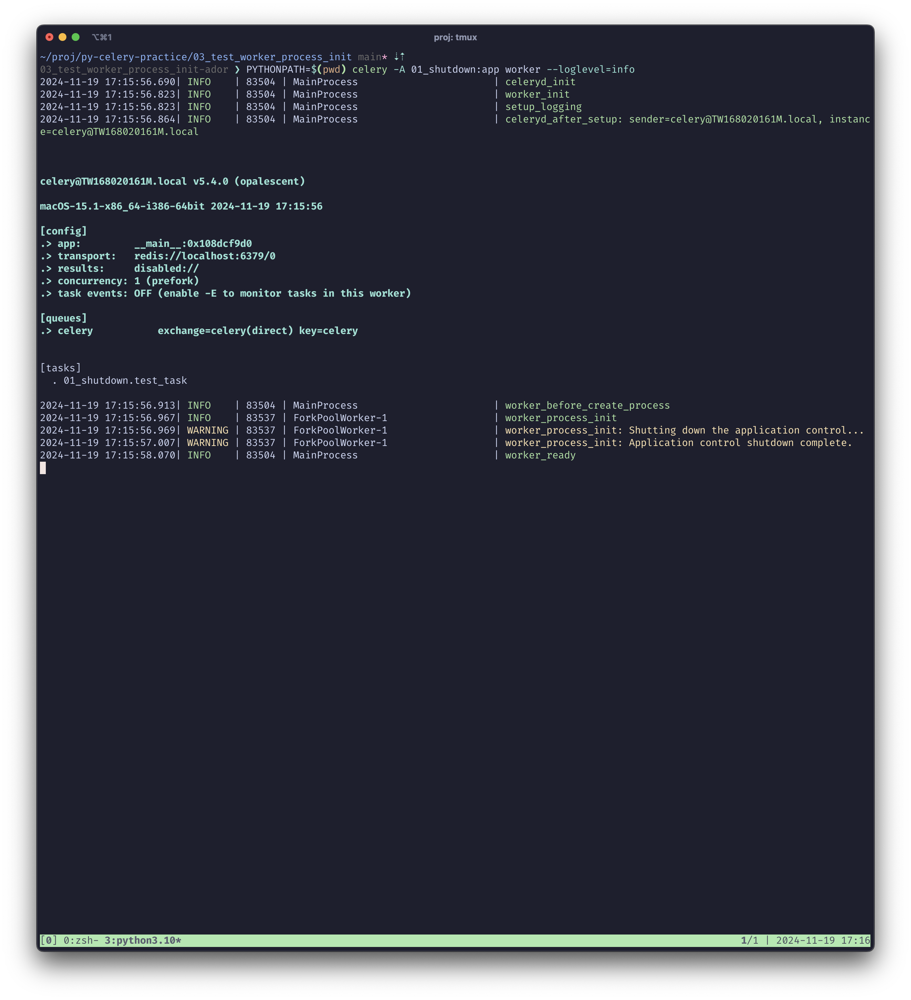
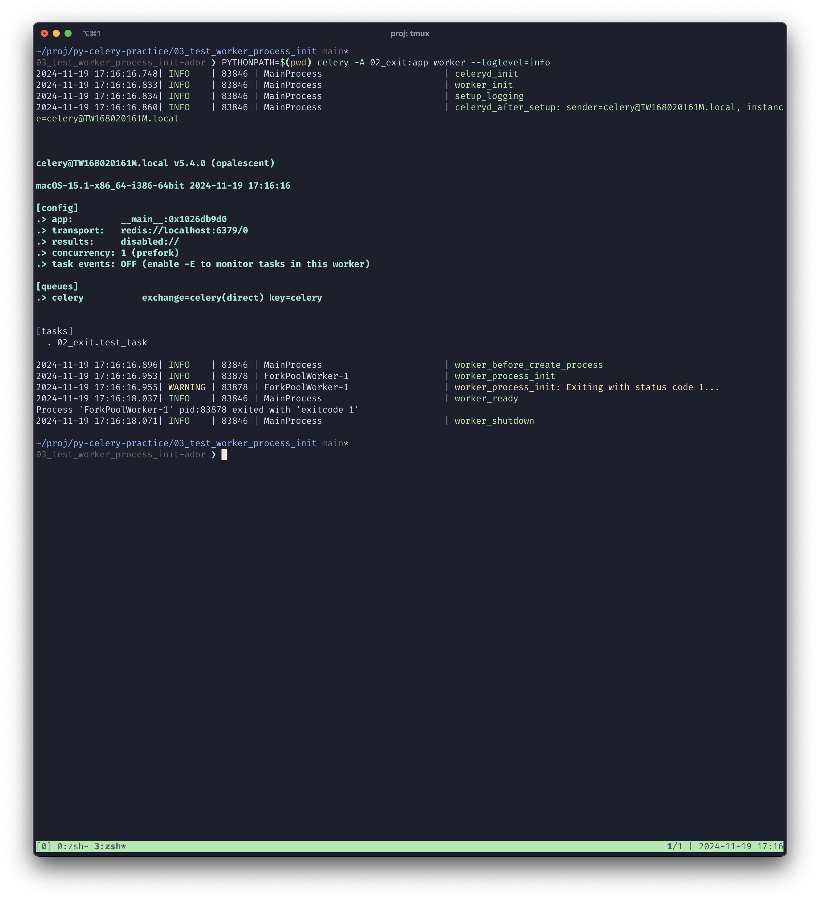
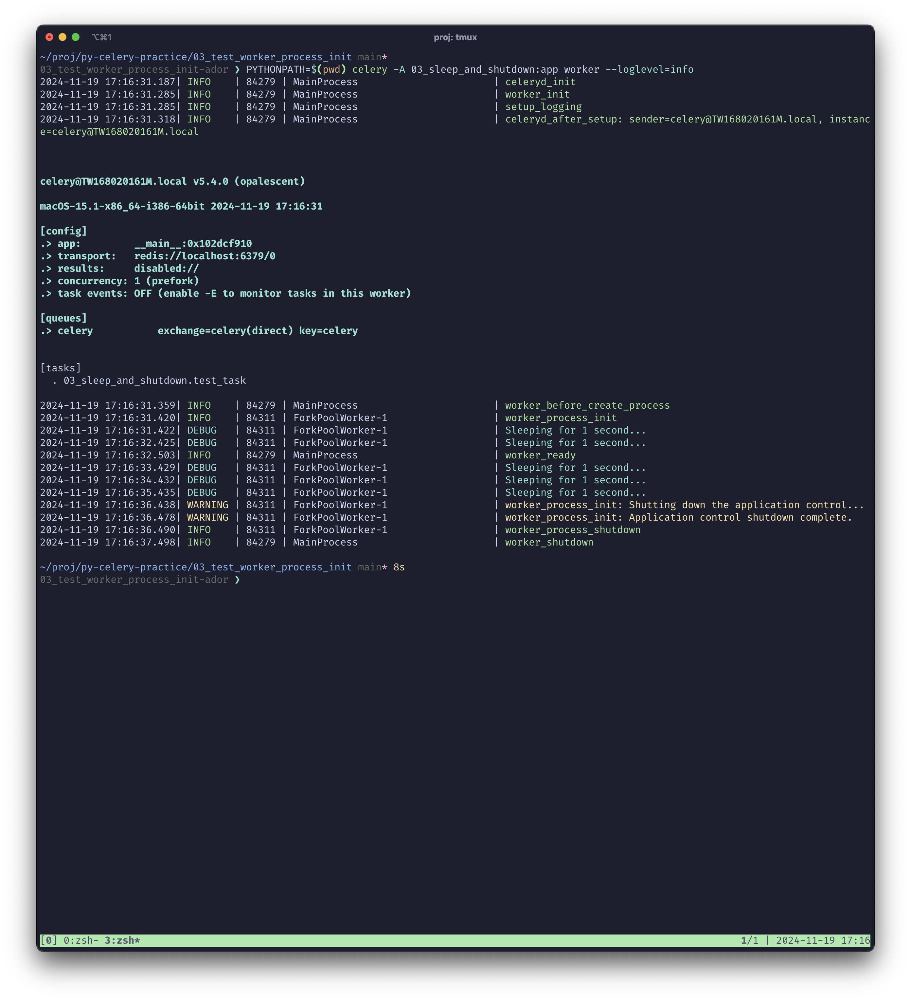
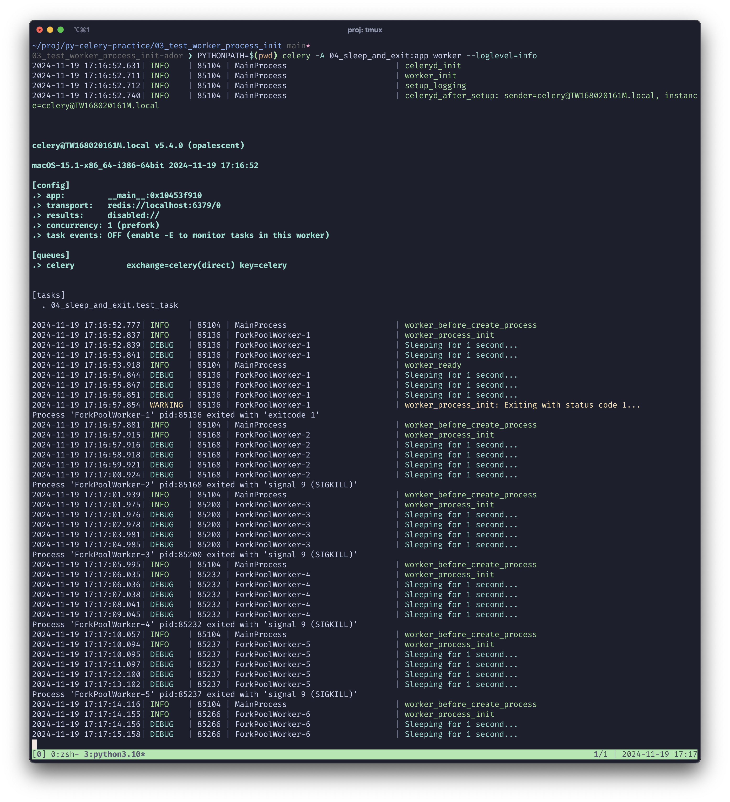

# Worker Process Initialization and Shutdown Behavior

### 1. 在 worker 準備好之前，shutdown 指令被忽略

當 `worker_process_init` 事件觸發時，如果在 worker 準備好之前執行 `app.control.shutdown()`，該指令將被忽略，無法正常關閉應用程序控制。

```python
@worker_process_init.connect
def worker_process_init_handler(**kwargs):
    logger = getLogger(__name__)

    logger.info("worker_process_init")
    logger.warning('worker_process_init: Shutting down the application control...')
    app.control.shutdown()
    logger.warning('worker_process_init: Application control shutdown complete.')
```



### 2. 在 worker 準備好之前，exit 指令有效

如果在 worker 準備好之前執行 `exit(1)`，則進程會正常退出，並顯示如下信息：<br>
`Process 'ForkPoolWorker-1' pid:99291 exited with 'exitcode 1'`

```python
@worker_process_init.connect
def worker_process_init_handler(**kwargs):
    logger = getLogger(__name__)

    logger.info("worker_process_init")
    logger.warning('worker_process_init: Exiting with status code 1...')
    exit(1)
```

### 3. 在 worker 準備好之後，shutdown 正常

當 worker 準備好後，執行 `app.control.shutdown()` 可以正常關閉應用程序控制。

```python
@worker_process_init.connect
def worker_process_init_handler(**kwargs):
    logger = getLogger(__name__)

    logger.info("worker_process_init")

    import time
    for i in range(5):
        logger.debug('Sleeping for 1 second...')
        time.sleep(1)

    logger.warning('worker_process_init: Shutting down the application control...')
    app.control.shutdown()
    logger.warning('worker_process_init: Application control shutdown complete.')
```



### 4. 在 worker 準備好之後，exit 指令不正常 (kill 9)，會一直重試

如果在 worker 準備好後執行 `exit(1)`，進程會不正常退出，並顯示如下信息，且會一直重試：<br>`Process 'ForkPoolWorker-8' pid:85336 exited with 'signal 9 (SIGKILL)'`

```python
@worker_process_init.connect
def worker_process_init_handler(**kwargs):
    logger = getLogger(__name__)

    logger.info("worker_process_init")

    import time
    for i in range(5):
        logger.debug('Sleeping for 1 second...')
        time.sleep(1)

    logger.warning('worker_process_init: Exiting with status code 1...')
    exit(1)
```


